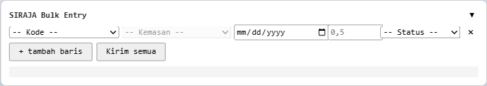

# Bulk Entry LB3 — Kalau bisa cepet kenapa harus lama?

Ekstensi Chrome untuk mengisi **Limbah B3 Dihasilkan** di SPEED (SIRAJA)
(`plb3.kemenlh.go.id`) secara massal — beberapa baris sekaligus lewat satu panel,
tanpa bolak-balik form satu per satu.

> **Buat yang males-males aja yaa! :D**



## Kenapa?

Form asli hanya bisa isi 1 baris → simpan → ulang. Kalau ada belasan entri per
periode, itu melelahkan dan membosankan. Ekstensi ini menaruh panel di halaman yang berisi
beberapa baris input, lalu mengirim semuanya berurutan ke endpoint simpan yang
sama dengan tombol "Simpan" bawaan.

Ini **bukan** eksploit keamanan — hanya otomasi pengisian data milikmu sendiri,
lewat sesi login dan endpoint yang sama persis dengan pemakaian manual.

## Fitur

- **Dropdown, bukan ketik** — Kode Limbah & Kemasan diambil langsung dari data
  pendaftaran limbahmu, jadi tidak ada salah kode atau salah format.
- **Kemasan otomatis** — begitu Kode dipilih, pilihan Kemasan yang valid untuk
  kode itu langsung dimuat.
- **Date picker bawaan browser** — rentang tanggal otomatis dibatasi (awal
  periode s/d hari ini) sesuai aturan form.
- **Tambah/hapus baris** sesukanya, lalu **Kirim semua** dengan satu klik.
- **Log per baris** — tiap baris dilaporkan OK atau GAGAL beserta alasannya
  (mis. jumlah melebihi kuota, session habis).

## Instalasi

1. Buka `chrome://extensions`.
2. Aktifkan **Developer mode** (pojok kanan atas).
3. Klik **Load unpacked** → pilih folder `siraja-bulk-extension` ini.
4. Buka halaman **LB3 → Dihasilkan**
   (`.../siraja-2024/lb3/dihasilkan/index/data`). Panel muncul di kanan bawah.

Setelah mengubah kode, klik **Reload** (↻) pada ekstensi lalu refresh
halaman.

## Cara pakai

1. Pastikan sudah **login** ke SPEED.
2. Di panel kanan bawah, untuk tiap baris:
   pilih **Kode** → **Kemasan** (muncul otomatis) → **Tanggal** → isi
   **Jumlah** → pilih **Status**.
3. Klik **+ tambah baris** untuk entri berikutnya.
4. Klik **Kirim semua**. Perhatikan log di bawah tombol.
5. Refresh halaman untuk melihat data di tabel.

**Jumlah** pakai koma sebagai desimal (mis. `0,5`) — ekstensi mengonversinya ke
titik saat mengirim, sesuai yang diminta server.

## Catatan penting

- Setiap "Kirim" **benar-benar menyimpan** ke sistem. Data yang salah **tidak
  bisa dihapus** dari sisi pengguna, jadi periksa dulu sebelum mengirim.
- Kalau sesi login habis di tengah jalan, log akan memberi tahu — cukup login
  ulang lalu klik Kirim lagi (baris yang belum terkirim saja).
- Batas kuota/tanggal divalidasi oleh server; baris yang melanggar akan muncul
  sebagai GAGAL dengan pesannya.

## Cara kerja (singkat)

- `manifest.json` — MV3, hanya aktif di halaman `dihasilkan`.
- `content.js` — membangun panel; membaca daftar Kode dari `<select>` halaman,
  memuat Kemasan via `GET .../dihasilkan/package/{id}`, lalu menyimpan tiap baris
  via `POST .../dihasilkan/save` (multipart, memakai cookie sesi — sama seperti
  submit form aslinya).
- `parse.js` — satu fungsi validasi/normalisasi angka (`normJumlah`).
- Sukses/gagal dibaca dari elemen `flashMessage` pada respons server.

## Test

```bash
node test_parse.js
```

Menguji normalisasi jumlah (`0,5` → `0.5`, tolak input non-numerik) secara
offline — tidak menyentuh server.
